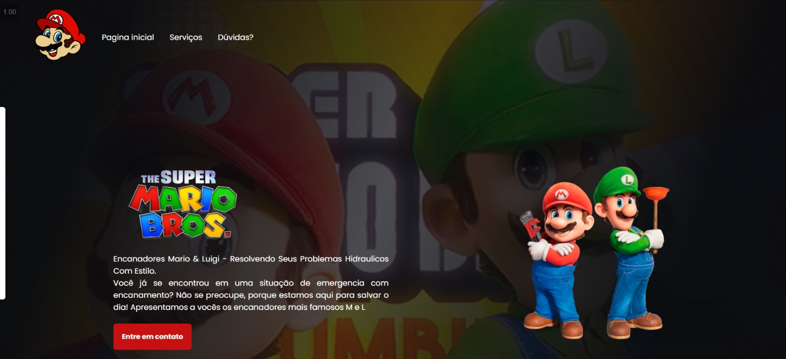
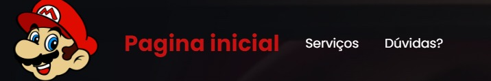
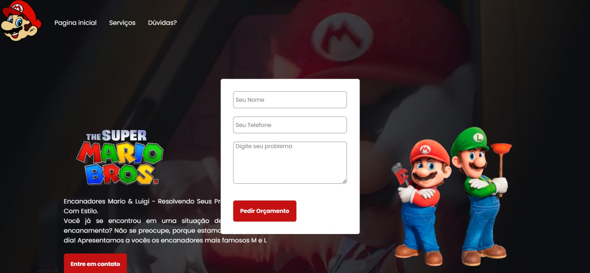

<h1>Projeto Mario Bros  
 
<h2>Projeto feito utilizando:   
 
<h3>Por ora, pensado somente na versão Desktop 🖥️ </h3>
 

 
<h3>Header personalizado com uma leve transição ao passar o mouse</h3>

 
<h3>Com direito a um simples formulário</h3>

